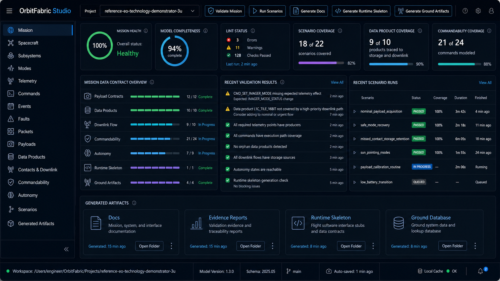
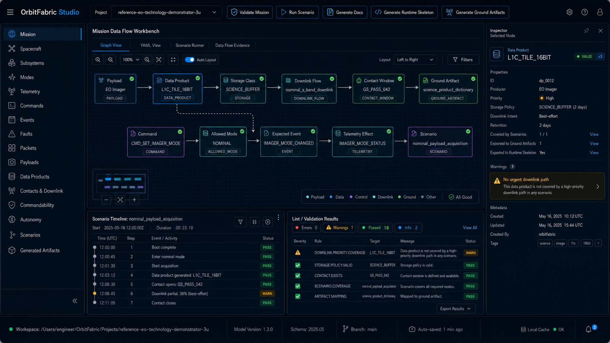

# OrbitFabric Studio - UI North Star Reference

## Purpose

These two images define the visual and conceptual north star for OrbitFabric Studio UI convergence.

They are not implementation specifications.
They are not semantic sources of truth.
They are product-direction references.

## Reference A - Mission Cockpit

Image:

Used primarily for:

- v0.10.0 - Mission Cockpit Consolidation
- cockpit layout grammar
- KPI/card density
- mission overview hierarchy
- recent validation/scenario/artifact presentation

Must not be copied semantically where Core does not provide data.

Unsupported or unavailable values must remain explicit.

## Reference B - Mission Data Flow Workbench

Image:

Used primarily for:

- v0.12.0 - Mission Data Flow Workbench Foundation
- v0.13.0 - Evidence-integrated Workbench
- graph/workbench grammar
- inspector binding
- scenario/evidence/validation integration

Not part of v0.10.0 implementation scope except as long-term visual direction.

## Binding rule

The images guide visual hierarchy, density, layout, and product grammar.

They do not authorize Studio to invent:

- mission health;
- operational readiness;
- model completeness;
- coverage semantics;
- graph semantics;
- live telemetry behavior;
- command uplink behavior;
- plugin behavior;
- generated artifact mutation.